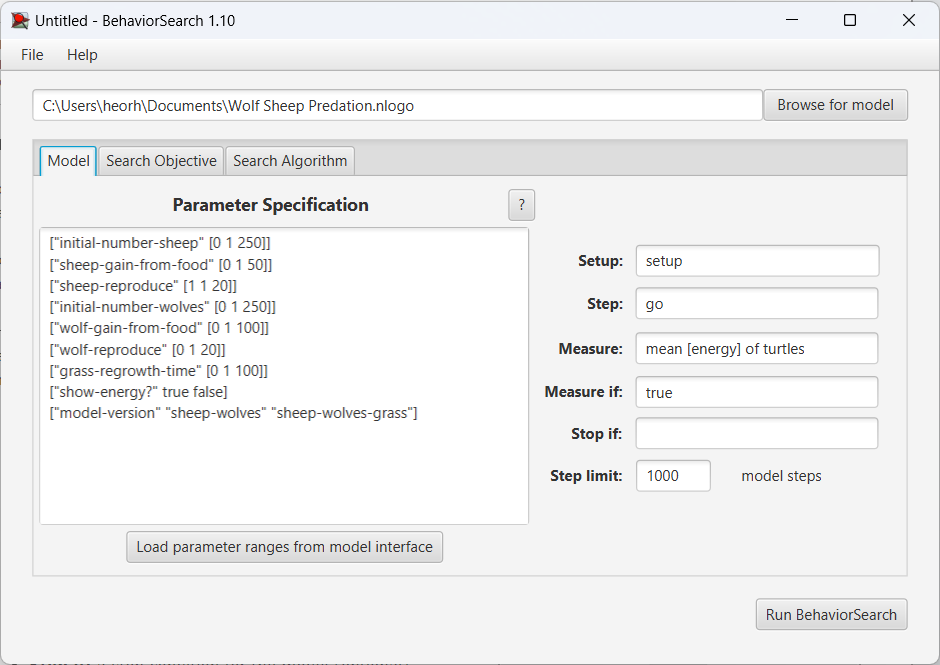
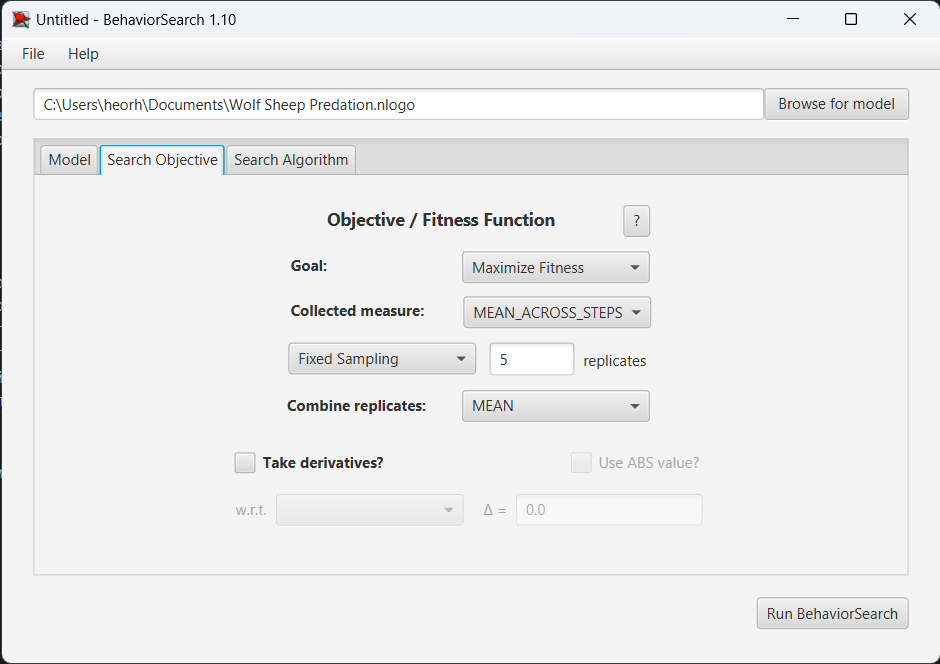
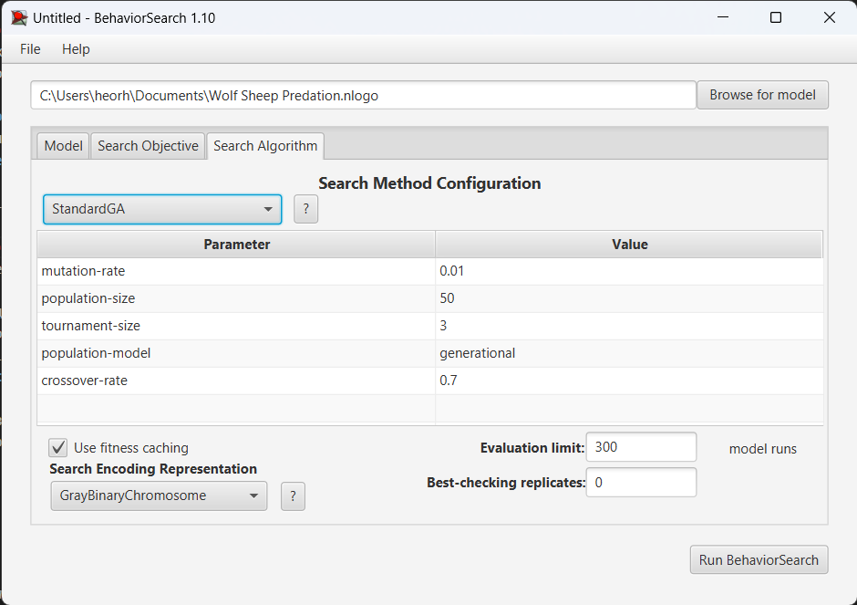
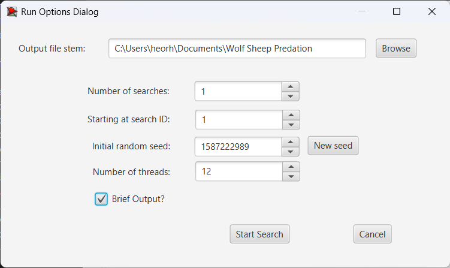
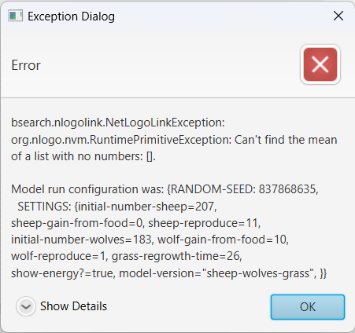
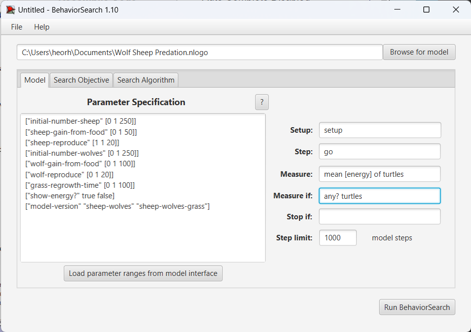
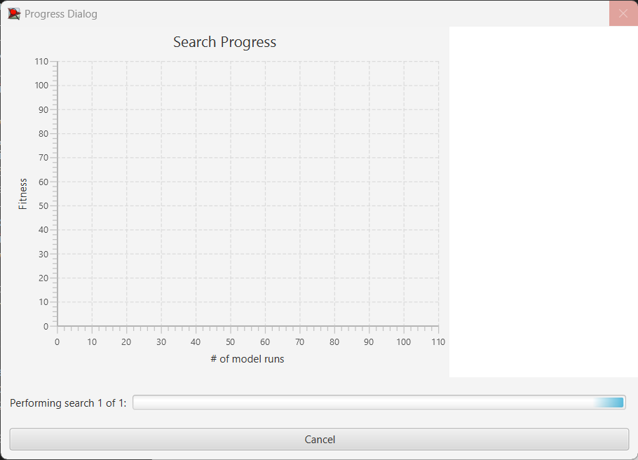
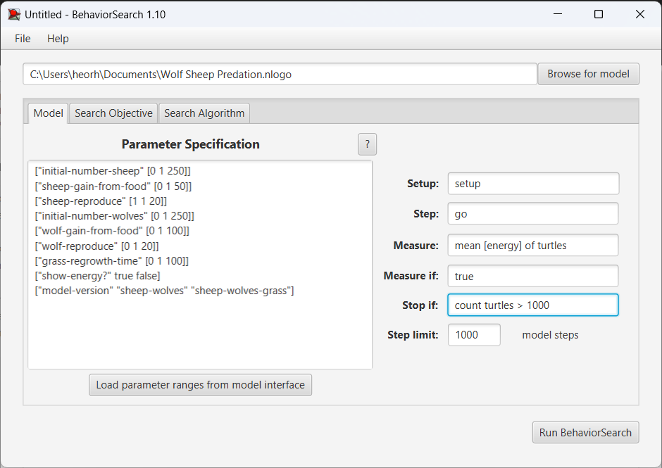
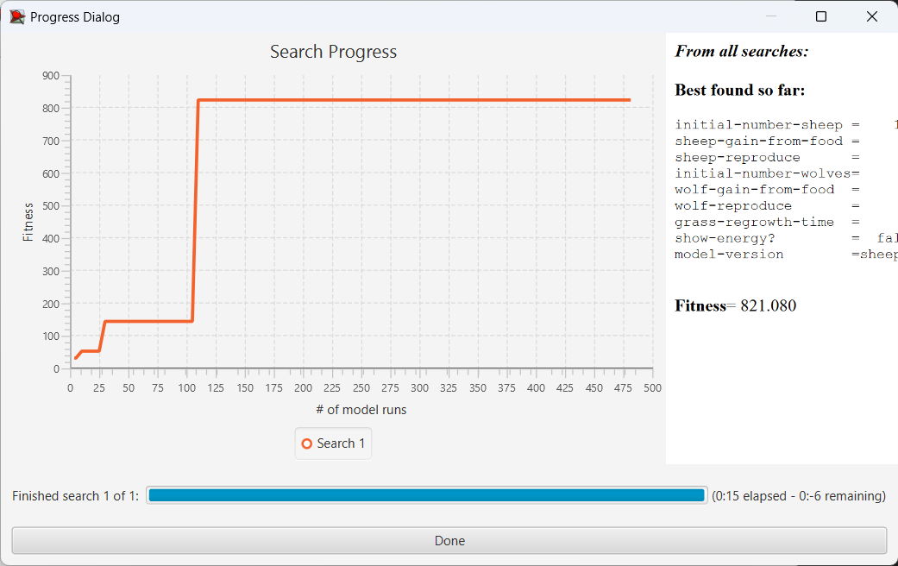
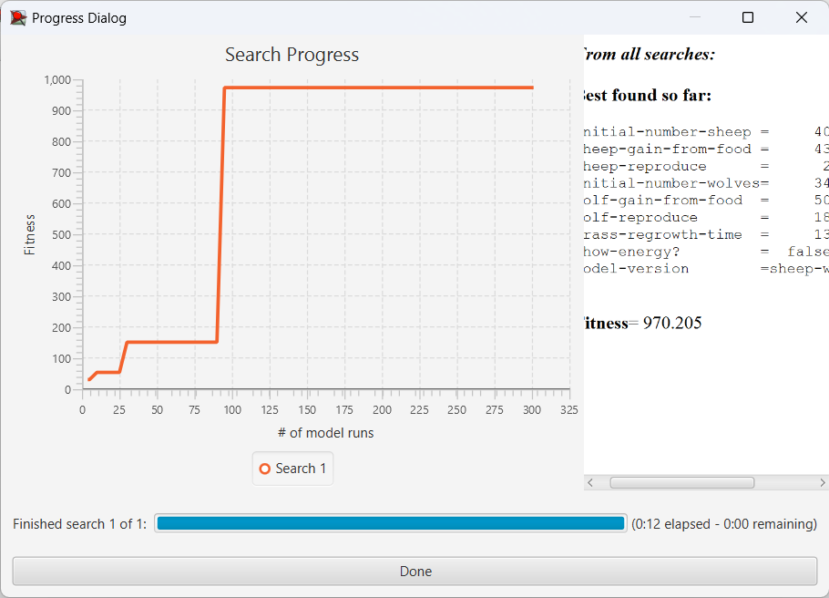

## Комп'ютерні системи імітаційного моделювання
## СПм-22-4, **Уваров Георгій Олексійович**
### Лабораторна робота №**1**. Опис імітаційних моделей та проведення обчислювальних експериментів

 

### Варіант 7 (20 mod 13), модель у середовищі NetLogo:
7. [Wolf Sheep Predation](http://www.netlogoweb.org/launch#http://www.netlogoweb.org/assets/modelslib/Sample%20Models/Biology/Wolf%20Sheep%20Predation.nlogo).

 

### Вербальний опис моделі:
Модель взаємоіснування хижаків та їх жертв. Є агенти-вівці, є агенти-вовки. Вони отримують енергію з їжею і розмножуються як прості мікроби - діляться, енергія розділяється між двома. Якщо енергія впаде до 0, помирають.
Симуляція закінчується, якщо не осталося вовків та овець, чи якщо не осталося вовків а овець стало забагато (10000).
Є можливість обрати версію "sheep-wolves-grass", де у овець буде обмежена кормова база з трави.

Sheep - вівці:
- розмножуються випадковим чином із рейтом sheep-reproduce.
sheep-wolves-grass версія:
- втрачають 1 енергії кожен крок.
- їдять траву: зелена клітина "з травою" стає коричневою "без трави".
- за 1 клітину трави поповнюють sheep-gain-from-food одиниць енергії.

Wolves - Вовки:
- розмножуються випадковим чином із рейтом wolf-reproduce.
- втрачають 1 енергії кожен крок.
- їдять 1 вівцю зі своєї клітини за такт.
- з'ївши вівцю відновлють wolf-gain-from-food одиниць енергії.

### Керуючі параметри:
- **initial-number-sheep** - скільки спочатку буде овець.
- **initial-number-wolves** - скільки спочатку буде вовків.
- **grass-regrowth-time** - рейт відновлення трави.
- **sheep-gain-from-food** - скільки енергії отримає вівця з клітини трави.
- **wolf-gain-from-food** - скільки енергії отримає вовк за вівцю.
- **sheep-reproduce** - шанс вівця народити іншу кожен такт.
- **wolf-reproduce** - шанс вовка народити іншого кожен такт.

### Внутрішні параметри:
- **energy** - скільки у вовка/вівці залишається енергії.

### Показники роботи системи:
- sheep - кількість овець.
- wolves - кількість вовків.
- grass - об'єм трави (кількість зелених клітин).

#### Показники роботи модеі:
- максимальна швидкість на поточному такті, тобто, швидкість найшвидшої на даний момент машини.
- найменша швидкість на поточному такті, тобто, швидкість найповільнішої в даний момент машини.
- середня швидкість руху машин на шосе.
- поточна швидкість окремої машини, що відстежується (червона машина).

 

### Налаштування середовища BehaviorSearch:

**Обрана модель**:
<pre>
C:\Users\heorh\Documents\Wolf Sheep Predation.nlogo
</pre>
**Параметри моделі** (вкладка Model):  
*Параметри та їх модливі діапазони були **автоматично** вилучені середовищем BehaviorSearch із вибраної імітаційної моделі, для цього є кнопка «Завантажити діапазони параметрів із інтерфейсу моделі»*:
<pre>
["initial-number-sheep" [0 1 250]]
["sheep-gain-from-food" [0 1 50]]
["sheep-reproduce" [1 1 20]]
["initial-number-wolves" [0 1 250]]
["wolf-gain-from-food" [0 1 100]]
["wolf-reproduce" [0 1 20]]
["grass-regrowth-time" [0 1 100]]
["show-energy?" true false]
["model-version" "sheep-wolves" "sheep-wolves-grass"]
</pre>
*Кількість машин було знижено мною, в порівнянні зі значенням за замовчуванням, для скорочення часу симуляції, оскільки налаштування цієї моделі демонструвалося на лекції і був сенс не затягувати необхідний для аналізу час.*  
Використовувана **міра**:  
Для фітнес-функції *(вона ж функція пристосованості або цільова функція)* було обрано **значення середньої швидкості всіх машин на трасі**, вираз для її розрахунку взято з налаштувань графіка аналізованої імітаційної моделі в середовищі NetLogo  
  
та вказано у параметрі "**Measure**":
<pre>
mean [energy] of turtles
</pre>
Середня енергыя всіх тварин на трасі повинна враховуватися **в середньому** за весь період симуляції тривалістю, 1000 тактів (адже на кожному такті є своє значення поточної середньої швидкості усіх учасників дорожного руху), починаючи з 0 такту симуляції.  
*Параметр "**Mesure if**" зі значення true, по суті, і означає, що враховуватимуться всі такти симуляції, а чи не частина їх. Іноді має сенс не враховувати деякі такти через хаос в деяких моделях на початку їх використання. Наприклад, це показано в прикладі з документації BehaviorSearch.  
Параметри "**Setup**" та "**Go**" вказують відповідні процедури ініціалізації та запуску в логіці моделі (зазвичай вони так і називаються). BehaviorSearch в процесі роботи, по суті, замість користувача запускає ці процедури.*  
Параметр зупинки за умовою ("**Stop if**") у разі не використовувався.  
Загальний вигляд вкладки налаштувань параметрів моделі:  

**Налаштування цільової функції** (вкладка Search Objective):  
Метою підбору параметрів імітаційної моделі, що описує дорожній рух двосмуговим шосе, є **максимізація** значення середньої швидкості машин на трасі – це вказано через параметр "**Goal**" зі значенням **Maximize Fitness**. Тобто необхідно визначити такі параметри налаштувань моделі, у яких машини рухаються з максимальною швидкістю. При цьому цікавить не просто середня швидкість всіх машин у якийсь окремий момент симуляції, а середнє її значення за всю симуляцію (тривалість якої (500 кроків) вказувалася на минулій вкладці). Для цього у параметрі "**Collected measure**", що визначає спосіб обліку значень обраного показника, вказано **MEAN_ACROSS_STEPS**.  
Щоб уникнути викривлення результатів через випадкові значення, що використовуються в логіці самої імітаційної моделі, **кожна симуляція повторюється по 5 разів**, результуюче значення розраховується як **середнє арифметичне**.
Загальний вигляд вкладки налаштувань цільової функції:  

**Налаштування алгоритму пошуку** (вкладка Search Algorithm):  
*На цьому етапі було визначено модель, налаштовано її параметри (тобто вказано, які з них незмінні, а які в процесі пошуку можуть змінюватися і в яких діапазонах), і обрано міру, що лежить в основі функції пристосованості, що дозволяє оцінити якість кожного перевіряємого BehaviorSearch варіантів рішення.  
У ході дослідження на лабораторній роботі використовуються два алгоритми: Випадковий пошук(**RandomSearch**) і Простий генетичний алгоритм (**StandardGA**).  
Для цих алгоритмів, що вирішують завдання пошуку такого набору параметрів імітаційної моделі, щоб задовольнити вимоги користувача (у нашому випадку – максимізувати значення середньої швидкості переміщення агентів у заданій імітаційній моделі), необхідно вказати "**Evaluation limit**" (число ітерацій пошуку, у разі ГА – це буде кількість поколінь), та "**Search Space Encoding Representation**" (спосіб кодування варіанта вирішення). Загальноприйнятого "кращого" способу кодування немає, треба куштувати, які підійдуть саме до вашої моделі.
Параметр "**Use fitness caching**" впливає лише на продуктивність.
Параметри, специфічні для генетичного алгоритму, можна використовувати за замовчанням, якщо це не завадить отримати результат. На захисті їх, звичайно, обговоримо.*  
Загальний вид вкладки налаштувань алгоритму пошуку:  

 

### Результати використання BehaviorSearch:
Діалогове вікно запуску пошуку *(можна залишити за замовчуванням, але стежте, куди пишеться результат)*:  

Помилка:

Fix:

### Спроба 2 Результати використання BehaviorSearch:

Результат пошуку параметрів імітаційної моделі, використовуючи **генетичний алгоритм**:  

Результат пошуку параметрів імітаційної моделі, використовуючи **випадковий пошук**:  

